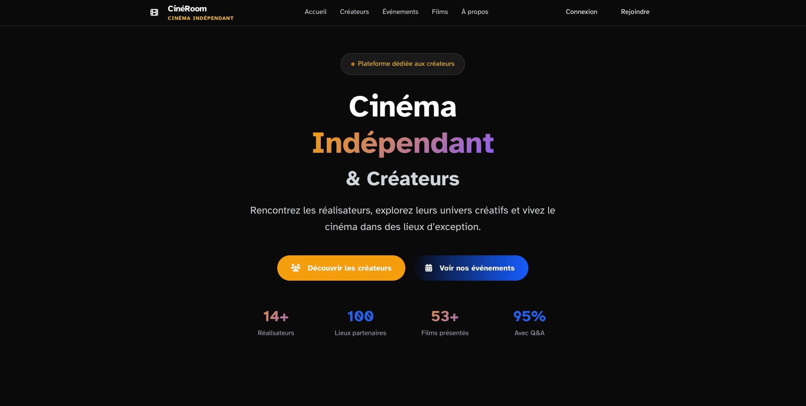
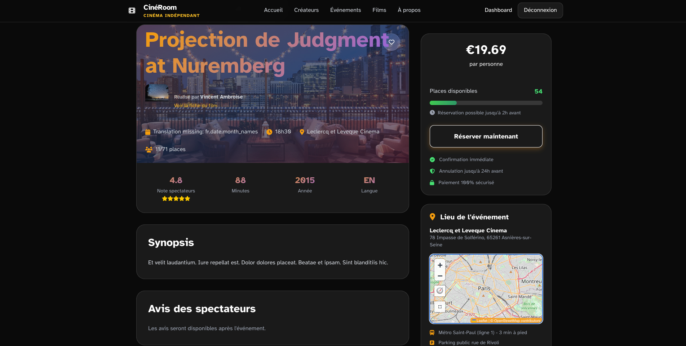
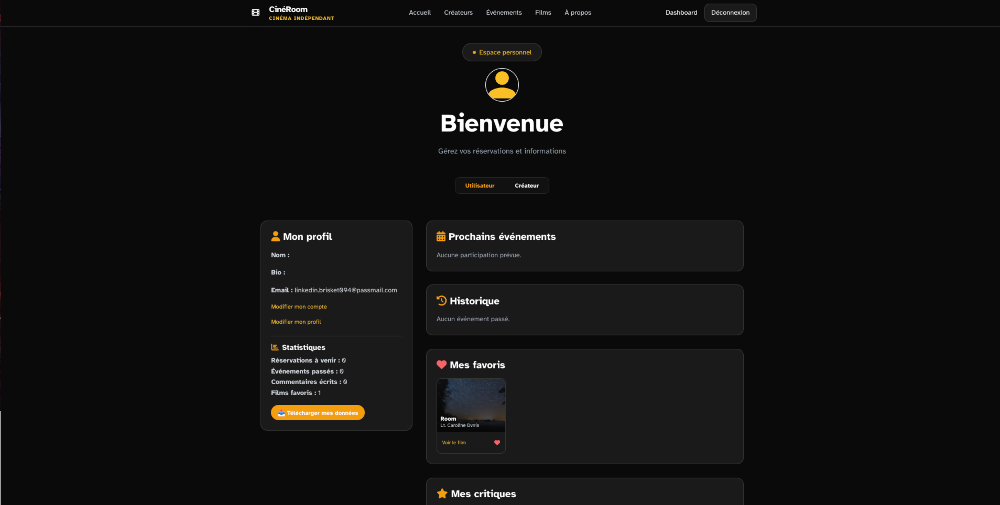
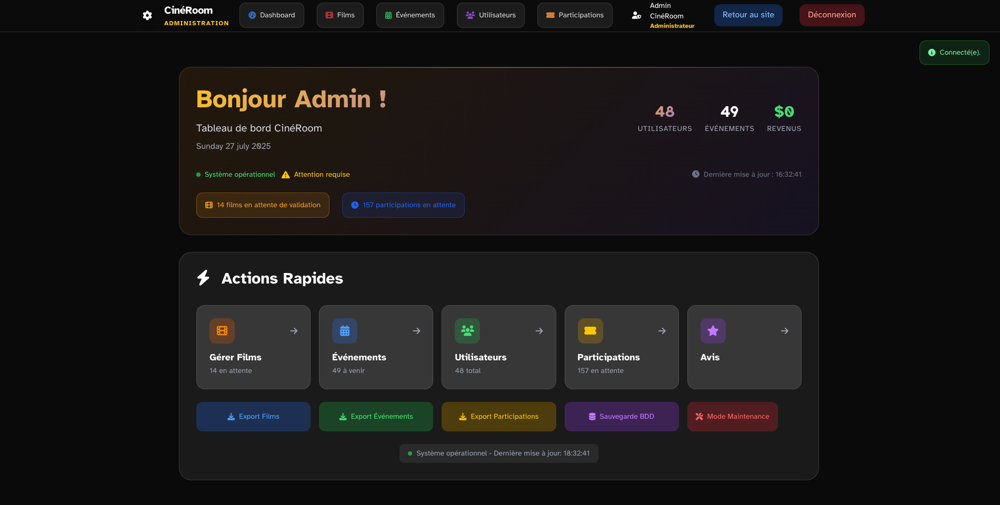
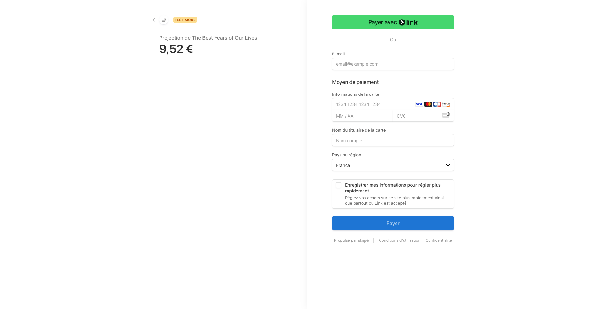
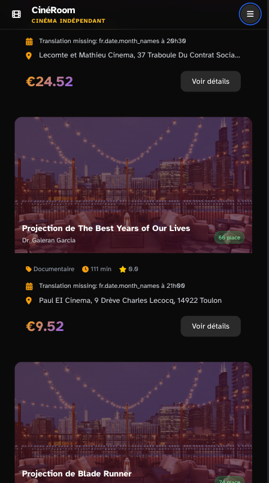

# 🎬 CinéRoom - Exclusive Cinema Experience Platform

> **Full-Stack Development Project** completed as part of The Hacking Project (THP) Full-Stack Developer Bootcamp validation.

## 📖 Project Overview

CinéRoom is a modern Ruby on Rails 8.0 platform that transforms independent film viewing into exclusive experiences. The application allows users to discover and book private film screenings in unique, unconventional venues (art galleries, rooftops, private mansions) with opportunities to meet the film's creative team.

**The concept addresses the need for a premium alternative to traditional cinema** by creating immersive events around independent films. Users can book limited seats for private premieres, meet the team (directors, actors, technical crew), and enjoy a unique evening experience.

**🌐 Live Demo**: [cineroom-95309b4cb0ca.herokuapp.com](https://cineroom-95309b4cb0ca.herokuapp.com/)

**🌐 Trello**: [cineroom-Trello](https://trello.com/invite/b/68651832a1ddaea497e9ffaa/ATTI2bdb69d4748f0e5cbaf6b5f7b78dc7de413EA373/cineroom)

---

## 🎯 Key Features & User Journeys

### 🎥 For Movie Enthusiasts (User Journey)

1. **Discover** events on the homepage with upcoming screenings
2. **Browse** available screenings with filters (date, venue, genre)
3. **View** event details: film info, synopsis, venue, date, special guests
4. **Create account** or sign in securely
5. **Book seats** via secure Stripe payment integration
6. **Receive** confirmation email with practical details
7. **Attend** exclusive screening experience
8. **Leave reviews** and ratings after the event
9. **Manage** bookings and favorites in personal dashboard

### 🎬 For Event Organizers (Admin Journey)

1. **Access** comprehensive admin interface
2. **Create** new films with complete metadata
3. **Schedule** events linked to approved films
4. **Configure** venue, date, capacity, and pricing
5. **Monitor** real-time booking status and availability
6. **Send** communications to participants
7. **Moderate** user reviews and feedback
8. **Track** analytics and revenue statistics

### 👨‍💼 For Administrators

- **Real-time** booking and participant oversight with AJAX updates
- **Analytics** dashboard for revenue and attendance tracking
- **GDPR-compliant** user data management with cookie consent
- **Comprehensive** movie approval workflow management

---

## 📸 Screenshots

### 🏠 Homepage


_Discover upcoming exclusive cinema events with elegant filtering and search capabilities_

### 🎬 Event Details


_Complete event information with venue details, pricing, and secure booking functionality_

### 👤 User Dashboard


_Personal space for managing bookings, reviews, and favorite movies_

### ⚡ Admin Interface


_Comprehensive admin panel for managing events, users, and analytics_

### 💳 Payment Flow


_Secure Stripe integration for seamless booking experience_

### 📱 Mobile Responsive


_Optimized mobile experience for on-the-go booking_

---

## 🛠️ Technology Stack & Architecture

| Category           | Technologies                           |
| ------------------ | -------------------------------------- |
| **Backend**        | Ruby 3.4.2, Rails 8.0.2                |
| **Frontend**       | Stimulus JS, Tailwind CSS 4.1          |
| **Database**       | PostgreSQL with ActiveRecord           |
| **Authentication** | Devise with Confirmable & Bcrypt       |
| **Payments**       | Stripe API integration                 |
| **File Storage**   | Cloudinary (production), ActiveStorage |
| **Job Processing** | SolidQueue (Rails 8.0 native)          |
| **Email**          | ActionMailer with Letter Opener (dev)  |
| **Admin Panel**    | Custom admin interface with AJAX       |
| **Maps**           | Leaflet with Geocoder                  |
| **Deployment**     | Heroku with PostgreSQL addon           |
| **Cache**          | SolidCache (Rails 8.0 native)          |

### 📊 Database Schema & Models

**Core Models & Relationships:**

```ruby
User (email, password_digest, first_name, last_name, role)
├── has_many :participations
├── has_many :reviews
├── has_many :favorites
└── has_many :movies (as creator)

Movie (title, synopsis, director, duration, genre, year, validation_status)
├── belongs_to :user (creator)
├── has_many :events
├── has_many :reviews
└── has_many :favorites

Event (title, venue_name, venue_address, event_date, max_capacity, price_cents, status)
├── belongs_to :movie
├── has_many :participations
└── has_many :users (through :participations)

Participation (stripe_payment_id, status, seats)
├── belongs_to :user
├── belongs_to :event
└── validates uniqueness of user_id scoped to event_id

Review (rating, comment)
├── belongs_to :user
├── belongs_to :movie
└── belongs_to :event

Favorite (user-movie bookmark system)
├── belongs_to :user
└── belongs_to :movie
```

---

## ✨ Modern Rails 8.0 Features

- **SolidQueue**: Native background job processing without Redis
- **SolidCache**: Built-in caching solution
- **Authentication**: Secure user management with email confirmation
- **GDPR Compliance**: Cookie consent system with French localization
- **Responsive Design**: Mobile-first Tailwind CSS implementation
- **AJAX Integration**: Real-time admin interface updates without page refresh

---

## 🚀 Installation & Setup

### Prerequisites

- Ruby 3.4.2+
- Rails 8.0.2
- PostgreSQL 14+
- Node.js 18+ (for Stimulus)

### Local Development Setup

```bash
# Clone the repository
git clone https://github.com/Paarroo/cine_room.git
cd cine_room

# Install Ruby dependencies
bundle install

# Install JavaScript dependencies
npm install

# Database setup
rails db:create
rails db:migrate
rails db:seed

# Start the development server
rails server
```

```

### Login Credentials

**Development (after `rails db:seed`):**

```

Admin: admin@cineroom.com / password123
Creator: creator.test@example.com / password123
User: user.test@example.com / password123
Creator 2: prolific.creator@example.com / password123

```

**Production:**

```

Admin credentials are configured via environment variables
Create a new user account through the registration process

```

---

## 🔒 Security & Compliance

- **Authentication Security**: Bcrypt password hashing with Devise
- **Email Validation**: Token-based account confirmation system
- **Data Validation**: Comprehensive server-side validation
- **CSRF Protection**: Rails built-in security measures
- **Payment Security**: PCI-compliant Stripe integration with secure token handling
- **GDPR Compliance**: Full cookie consent system with French localization
- **Role-based Access**: Secure admin interface with proper authorization

---

## 🎨 Design & User Experience

### Frontend Architecture

**Main Pages:**

- Homepage with upcoming events showcase
- Event detail pages with complete information
- Stripe-integrated payment flow
- Booking confirmation pages
- User dashboard (bookings, reviews, favorites)
- Advanced admin interface

**JavaScript Components (Stimulus):**

- Dynamic filtering system on homepage
- Real-time seat availability counter
- Stripe payment form integration
- Review rating system with stars
- Confirmation alerts before cancellation
- AJAX admin actions without page refresh

**Design Principles:**

- **Mobile-First**: Responsive design optimized for all devices
- **Modern Styling**: Tailwind CSS 4.1 with custom gold branding
- **Interactive Elements**: Stimulus controllers for dynamic UX
- **Real-time Updates**: AJAX-powered admin interface
- **Accessibility**: Semantic HTML and keyboard navigation support

---

## 🎓 Learning Outcomes & Technical Skills

This project demonstrates mastery of **full-stack development principles** taught in The Hacking Project bootcamp:

### Backend Development

- **MVC Architecture**: Proper separation of concerns using Rails scaffolds
- **Database Design**: Complex associations and data modeling
- **API Integration**: Stripe payments and external services
- **Authentication**: Secure user management with Devise
- **Background Jobs**: SolidQueue for email processing

### Frontend Development

- **Modern JavaScript**: Stimulus controllers for interactive features
- **Responsive Design**: Mobile-first Tailwind CSS implementation
- **AJAX Integration**: Real-time interface updates
- **Payment Forms**: Secure Stripe checkout implementation

### DevOps & Security

- **Production Deployment**: Heroku with proper environment configuration
- **Security Best Practices**: CSRF protection, secure authentication
- **Data Protection**: GDPR compliance and privacy controls
- **Error Handling**: Comprehensive validation and error management

---

## 🚀 Deployment & Production

### Heroku Production Deployment

The application is deployed on Heroku with:

- **PostgreSQL** database addon for data persistence
- **Cloudinary** for image storage and optimization
- **SSL/TLS** encryption for secure connections
- **Environment-based** configuration for security
- **Automated deployments** from main branch

### Key Production Features

- **Comprehensive database seeding** with FactoryBot and Faker
- **Transactional email delivery** via SMTP
- **Asset optimization** with Tailwind CSS compilation
- **Background job processing** with SolidQueue
- **Error monitoring** and performance tracking

---

## 👥 Team & Contributors

### 🚀 Active Contributors

# **Théo BANNERY** - Lead Developer, Project Architect & UI/UX Design

# **Florian BENOIT** - Full-Stack Developer & UI/UX Designer

_This project represents the collaborative effort of the active development team, with significant contributions from both Théo and Florian throughout the complete development lifecycle._

### Project Mentorship

- **Winny Drancourt** - Technical Mentor (The Hacking Project)

### Contributor

- **Mathieu MARILLER** - Initial project contributor (departed early in development)

---

## 🤝 Contributing

This project was developed as part of The Hacking Project bootcamp curriculum. While primarily an educational project, contributions and feedback are welcome for learning purposes.

### Development Standards

- **RESTful routing conventions** following Rails best practices
- **Rails 8.0 best practices** with modern framework features
- **Comprehensive testing** with RSpec and FactoryBot
- **GDPR compliance requirements** for European data protection
- **Mobile-first responsive design** principles

---

## 📄 License

This project is licensed under the MIT License - see the [LICENSE.md](LICENSE.md) file for details.

---

## 🙏 Acknowledgments

- **The Hacking Project (THP)** - For providing comprehensive full-stack development training
- **Winny Drancourt** - For technical mentorship and guidance throughout the project
- **Rails Community** - For the amazing framework and ecosystem
- **Stripe** - For secure payment processing infrastructure
- **Heroku** - For reliable cloud hosting platform
- **Independent Filmmakers** - For inspiring unique cinema experiences

---

**🎬 Built with ❤️ and Rails 8.0.2 as part of THP Full-Stack Developer Bootcamp**

_"Where independent cinema meets modern web development"_ ✨🍿
```
